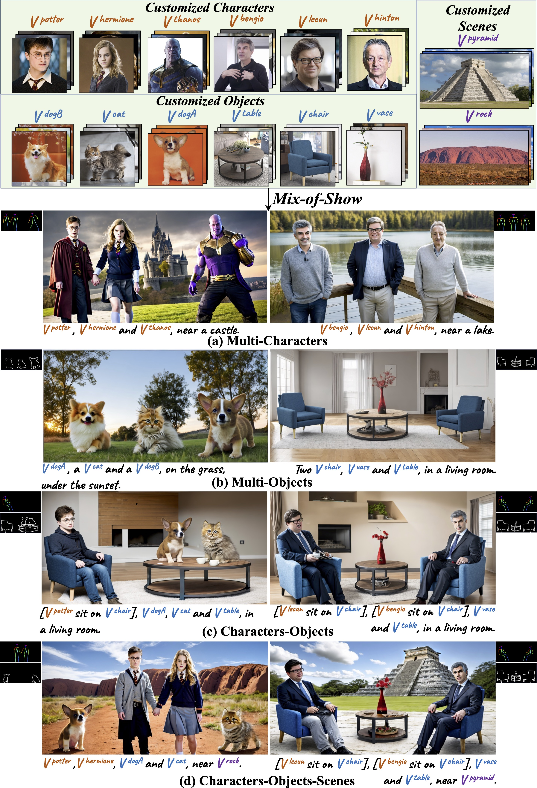

# Mix-of-Show

Official codes for Mix-of-Show. This branch is for application, including simplified codes, memory optimization and any improvements verified in research branch. For research purpose, please refer to [research branch](https://github.com/TencentARC/Mix-of-Show/tree/research_branch) (paper results, evaluation, and comparison methods).

**[Mix-of-Show: Decentralized Low-Rank Adaptation for Multi-Concept Customization of Diffusion Models](https://arxiv.org/abs/2305.18292)**
<br/>
[Yuchao Gu](https://ycgu.site/), [Xintao Wang](https://xinntao.github.io/), [Jay Zhangjie Wu](https://zhangjiewu.github.io/), [Yunjun Shi](https://yujun-shi.github.io/), [Yunpeng Chen](https://cypw.github.io/), Zihan Fan, Wuyou Xiao, [Rui Zhao](https://ruizhaocv.github.io/), Shuning Chang, [Weijia Wu](https://weijiawu.github.io/), [Yixiao Ge](https://geyixiao.com/), Ying Shan, [Mike Zheng Shou](https://sites.google.com/view/showlab)
<br/>

[](https://showlab.github.io/Mix-of-Show/)[](https://arxiv.org/abs/2305.18292)


## 📋 Results

### Single-Concept Sample Results


### Multi-Concept Sample Results

------

#### **Real-World Concept Results**



------

#### **Anime Concept Results**


## 🚩 Updates/Todo List

- [ ] Release Main Branch for Application (memory optimization, simplified codes).
- [ ] Release Colab Demo.
- [ ] Update Docs.
- [x] Jun. 12, 2023. Research Code Released. Please switch to [research branch](https://github.com/TencentARC/Mix-of-Show/tree/research_branch).


## 📜 License and Acknowledgement

This project is released under the [Apache 2.0 license](LICENSE).<br>
This codebase builds on [diffusers](https://github.com/huggingface/diffusers). Thanks for open-sourcing! Besides, we acknowledge following amazing open-sourcing projects:

- LoRA for Diffusion Models (https://github.com/cloneofsimo/lora, https://github.com/kohya-ss/sd-scripts).


- Custom Diffusion (https://github.com/adobe-research/custom-diffusion).


- T2I-Adapter (https://github.com/TencentARC/T2I-Adapter).


## 🌏 Citation

```bibtex
@article{gu2023mixofshow,
    title={Mix-of-Show: Decentralized Low-Rank Adaptation for Multi-Concept Customization of Diffusion Models},
    author={Gu, Yuchao and Wang, Xintao and Wu, Jay Zhangjie and Shi, Yujun and Chen Yunpeng and Fan, Zihan and Xiao, Wuyou and Zhao, Rui and Chang, Shuning and Wu, Weijia and Ge, Yixiao and Shan Ying and Shou, Mike Zheng},
    journal={arXiv preprint arXiv:2305.18292},
    year={2023}
}
```


## 📧 Contact

If you have any questions and improvement suggestions, please email Yuchao Gu (yuchaogu9710@gmail.com), or open an issue.
