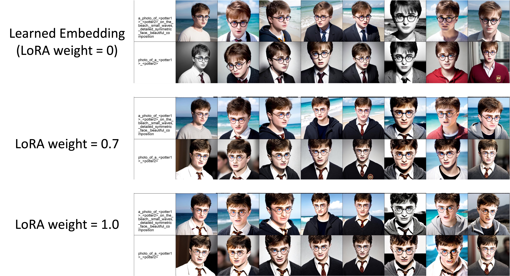
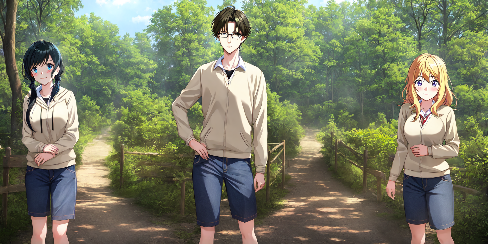

# Mix-of-Show

🚩🚩🚩: Main branch for community has been released (keep updating the main branch).

------

Official codes for Mix-of-Show. This branch is for application, including simplified codes, memory/speed optimization and performance improvement. For research purpose, please refer to original [research branch](https://github.com/TencentARC/Mix-of-Show/tree/research_branch) (paper results, evaluation, and comparison methods).

**[NeurIPS 2023]**- **[Mix-of-Show: Decentralized Low-Rank Adaptation for Multi-Concept Customization of Diffusion Models](https://arxiv.org/abs/2305.18292)**
<br/>
[Yuchao Gu](https://ycgu.site/), [Xintao Wang](https://xinntao.github.io/), [Jay Zhangjie Wu](https://zhangjiewu.github.io/), [Yunjun Shi](https://yujun-shi.github.io/), [Yunpeng Chen](https://cypw.github.io/), Zihan Fan, Wuyou Xiao, [Rui Zhao](https://ruizhaocv.github.io/), Shuning Chang, [Weijia Wu](https://weijiawu.github.io/), [Yixiao Ge](https://geyixiao.com/), Ying Shan, [Mike Zheng Shou](https://sites.google.com/view/showlab)
<br/>

[](https://showlab.github.io/Mix-of-Show/)[](https://arxiv.org/abs/2305.18292)

## 📋 Results

### Single-Concept Results

Difference from LoRA:

1) In ED-LoRA, the embedding (LoRA weight=0) already encodes stable identity (use harry potter as example):

   

2) Based on the ED-LoRA, we can support multi-concept fusion without much identity loss.

### Multi-Concept Results

**Concept List:**


**Anime Character**:



**Real Character**:


------

## 🚩 Updates/Todo List

- [ ] StableDiffusion XL support.
- [ ] Colab Demo.
- [x] Oct. 8, 2023. Add Attention Reg & Quality Improvement.
- [x] Oct. 3, 2023. Release Main Branch for Community.
- [x] Jun. 12, 2023. Research Code Released. Please switch to [research branch](https://github.com/TencentARC/Mix-of-Show/tree/research_branch).

## :wrench: Dependencies and Installation

- Python >= 3.9 (Recommend to use [Anaconda](https://www.anaconda.com/download/#linux) or [Miniconda](https://docs.conda.io/en/latest/miniconda.html))
- Diffusers==0.19.3
- XFormer (is recommend to save memory)

## ⏬ Pretrained Model and Data Preparation

### Pretrained Model Preparation

We adopt the [ChilloutMix](https://civitai.com/models/6424/chilloutmix) for real-world concepts, and [Anything-v4](https://huggingface.co/andite/anything-v4.0) for anime concepts.

```bash
git clone https://github.com/TencentARC/Mix-of-Show.git

cd experiments/pretrained_models

# Diffusers-version ChilloutMix
git-lfs clone https://huggingface.co/windwhinny/chilloutmix.git

# Diffusers-version Anything-v4
git-lfs clone https://huggingface.co/andite/anything-v4.0.git
```

### Data Preparation

Note: Data selection and tagging are important in single-concept tuning. We strongly recommend checking the data processing in [sd-scripts](https://github.com/kohya-ss/sd-scripts). **In our ED-LoRA, we do not require any regularization dataset.** The detailed dataset preparation steps can refer to [Dataset.md](docs/Dataset.md). Our preprocessed data used in this repo is available at [Google Drive](https://drive.google.com/file/d/1O5oev8861N_KmKtqefb45l3SiSblbo5O/view?usp=sharing).

## :computer: Single-Client Concept Tuning

### Step 1: Modify the Config

Before tuning, it is essential to specify the data paths and adjust certain hyperparameters in the corresponding config file. Followings are some basic config settings to be modified.

```yaml
datasets:
  train:
    # Concept data config
    concept_list: datasets/data_cfgs/edlora/single-concept/characters/anime/hina_amano.json
    replace_mapping:
      <TOK>: <hina1> <hina2> # concept new token
  val_vis:
    # Validation prompt for visualization during tuning
    prompts: datasets/validation_prompts/single-concept/characters/test_girl.txt
    replace_mapping:
      <TOK>: <hina1> <hina2> # Concept new token

models:
  enable_edlora: true  # true means ED-LoRA, false means vallina LoRA
  new_concept_token: <hina1>+<hina2> # Concept new token, use "+" to connect
  initializer_token: <rand-0.013>+girl
  # Init token, only need to revise the later one based on the semantic category of given concept

val:
  val_during_save: true # When saving checkpoint, visualize sample results.
  compose_visualize: true # Compose all samples into a large grid figure for visualization
```

### Step 2: Start Tuning

We tune each concept with 2 A100 GPU. Similar to LoRA, community user can enable gradient accumulation, xformer, gradient checkpoint for tuning on one GPU.

```bash
accelerate launch train_edlora.py -opt options/train/EDLoRA/real/8101_EDLoRA_potter_Cmix_B4_Repeat500.yml
```

### Step 3: Sample

**Download our trained model** from [Google Drive](https://drive.google.com/drive/folders/1ArvKsxj41PcWbw_UZcyc5NDcKEQjK8pl?usp=sharing).

Direct sample image:

```python
import torch
from diffusers import DPMSolverMultistepScheduler
from mixofshow.pipelines.pipeline_edlora import EDLoRAPipeline, StableDiffusionPipeline
from mixofshow.utils.convert_edlora_to_diffusers import convert_edlora

pretrained_model_path = 'experiments/pretrained_models/chilloutmix'
lora_model_path = 'experiments/2002_EDLoRA_hermione_Cmix_B4_Iter1K/models/checkpoint-latest/edlora.pth'
enable_edlora = True  # True for edlora, False for lora

pipeclass = EDLoRAPipeline if enable_edlora else StableDiffusionPipeline
pipe = pipeclass.from_pretrained(pretrained_model_path, scheduler=DPMSolverMultistepScheduler.from_pretrained(pretrained_model_path, subfolder='scheduler'), torch_dtype=torch.float16).to('cuda')
pipe, new_concept_cfg = convert_edlora(pipe, torch.load(lora_model_path), enable_edlora=enable_edlora, alpha=0.7)
extra_args = {'new_concept_cfg': new_concept_cfg} if enable_edlora else {}

TOK = '<hermione1> <hermione2>'  # the TOK is the concept name when training lora/edlora
prompt = f'a {TOK} in front of eiffel tower, 4K, high quality, high resolution'
negative_prompt = 'longbody, lowres, bad anatomy, bad hands, missing fingers, extra digit, fewer digits, cropped, worst quality, low quality'
image = pipe(prompt, negative_prompt=negative_prompt, height=768, width=512, num_inference_steps=50, guidance_scale=7.5, **extra_args).images[0]
image.save('res.jpg')
```

Or sampling image grids for comprehensive visualization: specify the model path in test config, and run following command. 

```bash
python test_edlora.py -opt options/test/EDLoRA/human/8101_EDLoRA_potter_Cmix_B4_Repeat500.yml
```

## :computer: Center-Node Concept Fusion

### Step 1: Collect Concept Models

Collect all concept models you want to extend the pretrained model and modify the config in **datasets/data_cfgs/MixofShow/multi-concept/real/*** accordingly.

```yaml
[
    {
        "lora_path": "experiments/EDLoRA_Models/Base_Chilloutmix/characters/edlora_potter.pth", # ED-LoRA path
        "unet_alpha": 1.0, # usually use full identity = 1.0
        "text_encoder_alpha": 1.0, # usually use full identity = 1.0
        "concept_name": "<potter1> <potter2>" # new concept token
    },
    {
        "lora_path": "experiments/EDLoRA_Models/Base_Chilloutmix/characters/edlora_hermione.pth",
        "unet_alpha": 1.0,
        "text_encoder_alpha": 1.0,
        "concept_name": "<hermione1> <hermione2>"
    },

    ... # keep adding new concepts for extending the pretrained models
]
```

### Step 2: Gradient Fusion

```bash
bash fuse.sh
```

### Step 3: Sample

**Download our fused model** from [Google Drive](https://drive.google.com/drive/folders/1ArvKsxj41PcWbw_UZcyc5NDcKEQjK8pl?usp=sharing).

**Single-concept sampling from fused model:**

```python
import json
import os

import torch
from diffusers import DPMSolverMultistepScheduler

from mixofshow.pipelines.pipeline_edlora import EDLoRAPipeline

pretrained_model_path = 'experiments/composed_edlora/chilloutmix/potter+hermione+thanos_chilloutmix/combined_model_base'
enable_edlora = True  # True for edlora, False for lora

pipe = EDLoRAPipeline.from_pretrained(pretrained_model_path, scheduler=DPMSolverMultistepScheduler.from_pretrained(pretrained_model_path, subfolder='scheduler'), torch_dtype=torch.float16).to('cuda')
with open(f'{pretrained_model_path}/new_concept_cfg.json', 'r') as fr:
    new_concept_cfg = json.load(fr)
pipe.set_new_concept_cfg(new_concept_cfg)

TOK = '<thanos1> <thanos2>'  # the TOK is the concept name when training lora/edlora
prompt = f'a {TOK} in front of mount fuji'
negative_prompt = 'longbody, lowres, bad anatomy, bad hands, missing fingers, extra digit, fewer digits, cropped, worst quality, low quality'

image = pipe(prompt, negative_prompt=negative_prompt, height=1024, width=512, num_inference_steps=50, generator=torch.Generator('cuda').manual_seed(1), guidance_scale=7.5).images[0]

save_dir = 'debug_combined/combine_thanos/'
os.makedirs(save_dir, exist_ok=True)
image.save(f'{save_dir}/res.jpg')
```

**Regionally controllable multi-concept sampling:**

```bash
bash regionally_sample.sh
```

## 📜 License and Acknowledgement

This project is released under the [Apache 2.0 license](LICENSE).<br>
This codebase builds on [diffusers](https://github.com/huggingface/diffusers). Thanks for open-sourcing! Besides, we acknowledge following amazing open-sourcing projects:

- LoRA for Diffusion Models (https://github.com/cloneofsimo/lora, https://github.com/kohya-ss/sd-scripts).


- Custom Diffusion (https://github.com/adobe-research/custom-diffusion).


- T2I-Adapter (https://github.com/TencentARC/T2I-Adapter).


## 🌏 Citation

```bibtex
@article{gu2023mixofshow,
    title={Mix-of-Show: Decentralized Low-Rank Adaptation for Multi-Concept Customization of Diffusion Models},
    author={Gu, Yuchao and Wang, Xintao and Wu, Jay Zhangjie and Shi, Yujun and Chen Yunpeng and Fan, Zihan and Xiao, Wuyou and Zhao, Rui and Chang, Shuning and Wu, Weijia and Ge, Yixiao and Shan Ying and Shou, Mike Zheng},
    journal={arXiv preprint arXiv:2305.18292},
    year={2023}
}
```


## 📧 Contact

If you have any questions and improvement suggestions, please email Yuchao Gu (yuchaogu9710@gmail.com), or open an issue.
